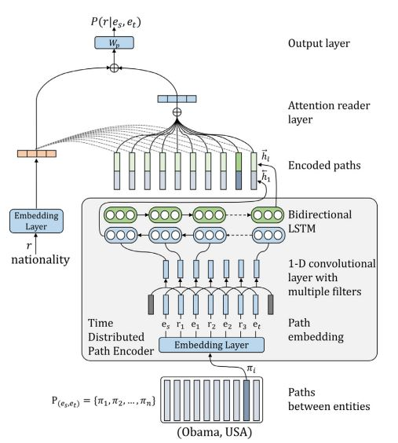

## LSTM-CNN for knowledge graph completion in Keras

### Required Files

- data/processed_data.tar.gz - dataset files containing grounded paths with relations and entities (e.g e1, r1, e2, r2, e3).
- tasks - can be downloaded from [1].

For generating relation paths such as (r1, r2, ..., rk), we used [2].

The original knowledge graph data we used for our experiments can be found in [1] which includes tasks datasets with train/test triples.

### Reference:
- [1] https://github.com/shehzaadzd/MINERVA/tree/master/datasets/data_preprocessed
- [2] https://github.com/noon99jaki/pra

